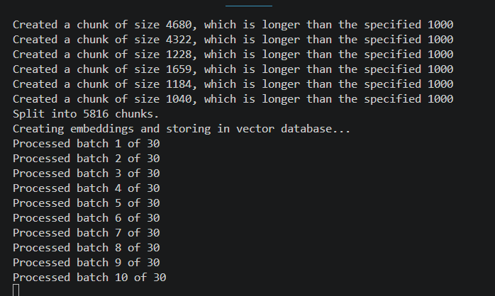
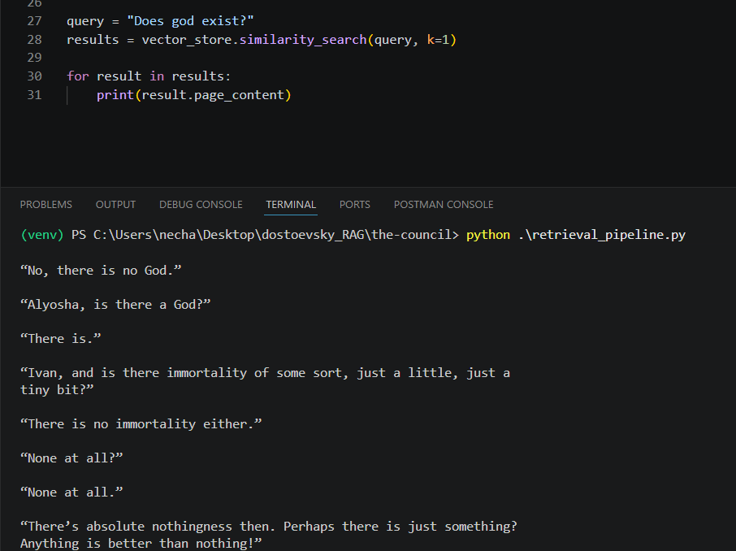

# The Council

The council is a RAG system that has been fed philosophers and various deep thinkers.

# Step1: Ingestion Pipeline

`ingestion_pipeline.py` is the script responsible for ingesting texts into the system. It reads the text files, processes them, and stores them in a format suitable for retrieval.

First I created a virtual environment and installed the necessary dependencies:

```bash
python -m venv venv
venv\Scripts\activate # because Im on windows. on linux its source venv/bin/activate
pip install langchain langchain-community langchain_text_splitters langchain-google-genai supabase tqdm # Im using genai cuz its free rather than openai which is paid.
```

Next, I wrote scrit for ingestion of the text files.

# Issue#1 : Rate Limiting Problem

Im running into a rate limit problem. The free tier of gemini-embedding-001 only allows 100 requests/minute. I am trying to embed 5816 chunks at once.

So solution for this is to create a batching system and wait in between. I will build this project FREE of cost, even though the whole thing would cost me a few cents if I paid.

So the idea is I import time, create a for loop that creates batches and then runs the vector store function and has a sleep/wait timer.


# THE SOLUTION TO THE RATE LIMIT PROBLEM

So it turns out I was wrong. I'm sending requests of 50 chunks in 1 batch, but I'm doing a sleep(32) seconds, which is wasting time.
I need to have a token aware system that is sending 50 x 100 batches, since 100 batches = 100 requests, under the API rate limit.
So I need a system that is aware of the tokens and waits before sending more requests. I tried optimizing it but it is still slow. Fastest I can get it is 50 minutes and I dont want to wait 50 minutes, so I just upgraded my google plan. 1M tokens/minute rate now. We chill.

It broke after 20/30 batches, so I truncated the DB on supabase, then re-ran with 250 chunks per batch, and a 3 second wait timer. No retry function since this is a one time thing.



# The Retrieval Pipeline

I used the same embedding model and connected to the same supabase vector store. I ran a simple "does god exist?" query and it worked. I got a response that was relevant to the question, and the source was from the books of Dostoevsky, which is what I wanted.


