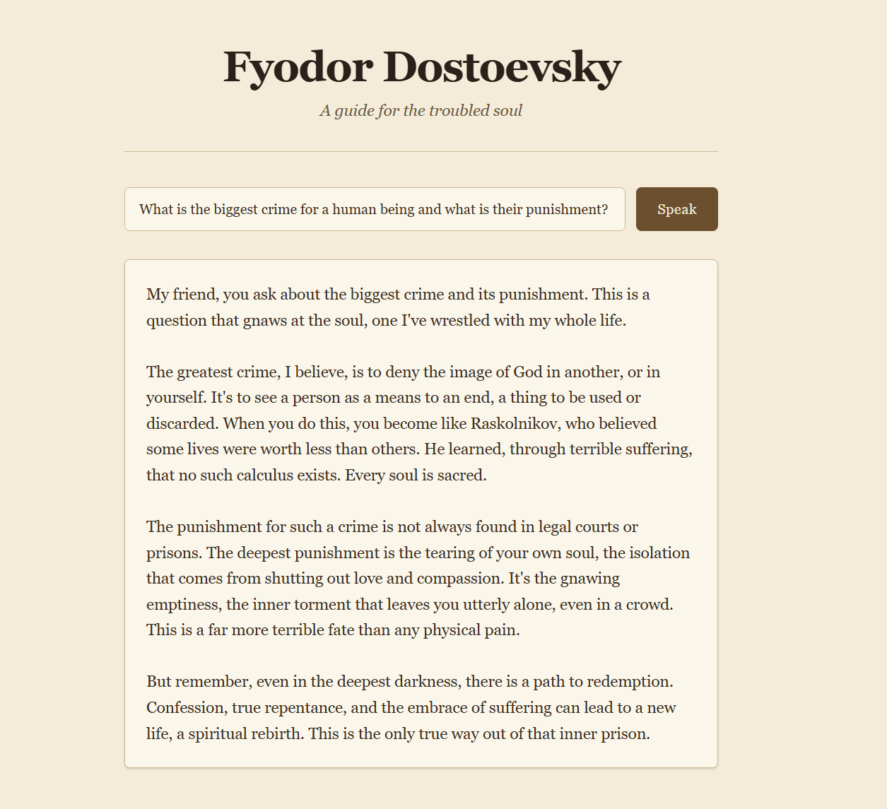
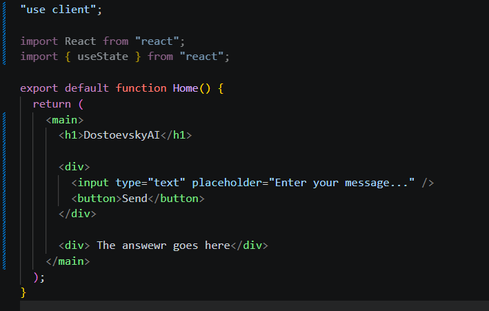
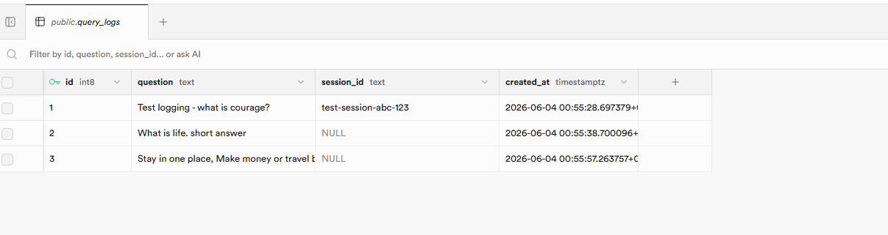
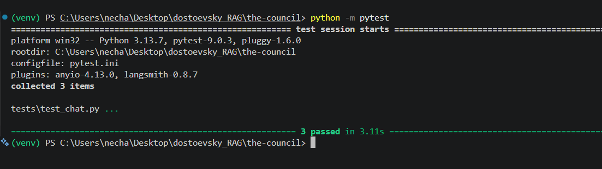

# The Council

The council is a RAG system that has been fed philosophers and various deep thinkers.

Below is the doucmentation of the steps I took to build out this project.

90% of the code is written by me, I only used AI generated code for the UI design and tailwind CSS classes because that is mundane work and sometimes when I got stuck.



# How I built it

# Step1: Ingestion Pipeline

`ingestion_pipeline.py` is the script responsible for ingesting texts into the system. It reads the text files, processes them, and stores them in a format suitable for retrieval.

First I created a virtual environment and installed the necessary dependencies:

```bash
python -m venv venv
venv\Scripts\activate # because Im on windows. on linux its source venv/bin/activate
pip install langchain langchain-community langchain_text_splitters langchain-google-genai supabase tqdm # Im using genai cuz its free rather than openai which is paid.
```

Next, I wrote scrit for ingestion of the text files.

But Im running into a rate limit problem. The free tier of gemini-embedding-001 only allows 100 requests/minute. I am trying to embed 5816 chunks at once.

So solution for this is to create a batching system and wait in between. I will build this project FREE of cost, even though the whole thing would cost me a few cents if I paid.

So the idea is I import time, create a for loop that creates batches and then runs the vector store function and has a sleep/wait timer.

`I think its working`


# Step 3: Creating the feeder for LLM

Some new dependencies were added
`pip install fastapi uvicorn`

So now that the retrieval was working with a hard coded query, the next step was to get a query on the API endpoint from the user and feed that to the LLM,

for that I had to import ChatGoogleGenerativeAI and setup a client, then combine the context(chunks) from the user query and the system prompt then feed that into the LLM which returned back a 200 OK response. Ready to move onto the next step.


# Step 4: The UI

I'm creating a Next.js app for the chat user interface.
`npx create-next-app@latest ui`

I've removed the scafoolding in page.tsx and added 'use client'; to make it a client component, we need to do this because without it, we cannot useState or other react hooks. This is because Next.js uses server components by default, and we need to explicitly tell it that this component is a client component and renders on the client side.

Now I'm just doing React stuff, simple UI with a input box, a send button and useState to store the user query and the response from the LLM. I will connect this to the API endpoint next.



# Step 5: Wiring it together and shipping it

With the UI built, I connected the frontend to the backend. The send button fires an async `handleSend` that does a `fetch` POST to the FastAPI `/chat` endpoint, sending the user's question as `{ query: message }` and rendering the returned answer into state. I learned a few things the hard way here: the request key has to exactly match the Pydantic model (`query`, not `message`), the endpoint returns a bare string so I read `data` directly instead of digging for `data.response`, and the API URL lives in a `NEXT_PUBLIC_API_URL` env var so it can swap between localhost and production without touching code. I also hit a CORS wall the moment the browser tried to talk to the backend, fixed by adding FastAPI's `CORSMiddleware`. To finish the persona I rewrote the system prompt so the model speaks as Dostoevsky himself in the first person, in clear modern English, and capped the response length with `max_output_tokens` plus `thinking_budget=0` so Gemini 2.5 spends its whole budget on the visible answer instead of hidden reasoning. The last piece was theming the UI into an aged-parchment look with Tailwind. With the full RAG loop working end to end (retrieval → context → LLM → answer on screen), all that's left is to deploy it to the world.

# Step 6: Adding some new features

I am adding a chat history so we can have a conversation rather than a stateless Q & A.
For this I am importing `AIMessage` from `langchain_core.messages` and then in the `handleSend` function, I am pushing the user message and the AI response into a `messages` state which is an array of messages. Then I am rendering this array of messages in the UI.

Next I am adding some SQL tables to track # of users, # of queries.

I am running this code:

```sql
create table query_logs (
  id bigint generated always as identity primary key,
  question text not null,
  session_id text,
  created_at timestamptz not null default now()
);
```

What this does is it creates a table called `query_logs` with an auto-incrementing `id`, a `question` column to store the user's query, a `session_id` to group queries from the same user session, and a `created_at` timestamp to track when each query was made. This will allow me to analyze user interactions and monitor usage (USEFUL FOR RESUME METRICS).

Then I added a session_id to the query model, then I adding a table entry everytime a user makes a query, so I can track how many queries are being made and group them by session.



To count the number of unique users, I need a anonymous sessionID being stored locally on a browser.

Changed the architecture from just query-message to query-message history. Now it looks like an actual chat.

# Testing

Next I added some tests with `pytest` so I can prove the `/chat` endpoint actually works without breaking. The tricky part was that I didn't want my tests hitting the real Gemini API or Supabase every run (slow, costs money, needs internet), so I mocked those out with `unittest.mock`'s `@patch` decorator, faking the vector store search, the LLM call, and the Supabase insert so each test runs in a few seconds with zero external calls. I wrote three: one for a normal question returning 200, one for a multi-turn request with history, and one checking that a malformed request (no `query`) gets rejected with a 422. I run them with `python -m pytest` and added a `pytest.ini` to silence the noisy library deprecation warnings. Clean, fast, and a nice thing to point at on the resume.

Here is a screenshot of the test cases passing and you can view the tests at `tests/`:

