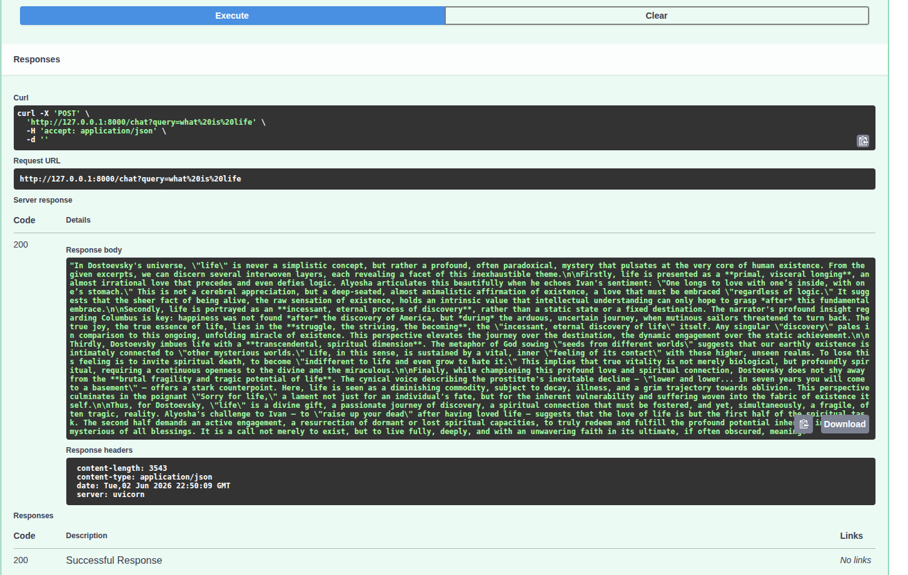

# The Council

The council is a RAG system that has been fed philosophers and various deep thinkers.

# Step1: Ingestion Pipeline

`ingestion_pipeline.py` is the script responsible for ingesting texts into the system. It reads the text files, processes them, and stores them in a format suitable for retrieval.

First I created a virtual environment and installed the necessary dependencies:

```bash
python -m venv venv
venv\Scripts\activate # because Im on windows. on linux its source venv/bin/activate
pip install langchain langchain-community langchain_text_splitters langchain-google-genai supabase tqdm # Im using genai cuz its free rather than openai which is paid.
```

Next, I wrote scrit for ingestion of the text files.

But Im running into a rate limit problem. The free tier of gemini-embedding-001 only allows 100 requests/minute. I am trying to embed 5816 chunks at once.

So solution for this is to create a batching system and wait in between. I will build this project FREE of cost, even though the whole thing would cost me a few cents if I paid.

So the idea is I import time, create a for loop that creates batches and then runs the vector store function and has a sleep/wait timer.

`I think its working`


# Step 3: Creating the feeder for LLM

Some new dependencies were added
`pip install fastapi uvicorn`

So now that the retrieval was working with a hard coded query, the next step was to get a query on the API endpoint from the user and feed that to the LLM,

for that I had to import ChatGoogleGenerativeAI and setup a client, then combine the context(chunks) from the user query and the system prompt then feed that into the LLM which returned back a 200 OK response. Ready to move onto the next step.



# Step 4: The UI

I'm creating a Next.js app for the chat user interface.
`npx create-next-app@latest ui`

I've removed the scafoolding in page.tsx and added 'use client'; to make it a client component, we need to do this because without it, we cannot useState or other react hooks. This is because Next.js uses server components by default, and we need to explicitly tell it that this component is a client component and renders on the client side.

Now I'm just doing React stuff, simple UI with a input box, a send button and useState to store the user query and the response from the LLM. I will connect this to the API endpoint next.
